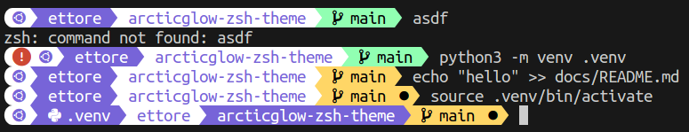

# Artic Glow

This is a theme for Oh My Zsh. It's based on [Agnoster](https://gist.github.com/3712874).



## Installation

- Clone the repository

  ```sh
  git clone https://github.com/Etto48/articglow-zsh-theme.git
  ```

- Run the installation script

  ```sh
  cd articglow-zsh-theme
  ./install.sh
  ```

- Reload your terminal
